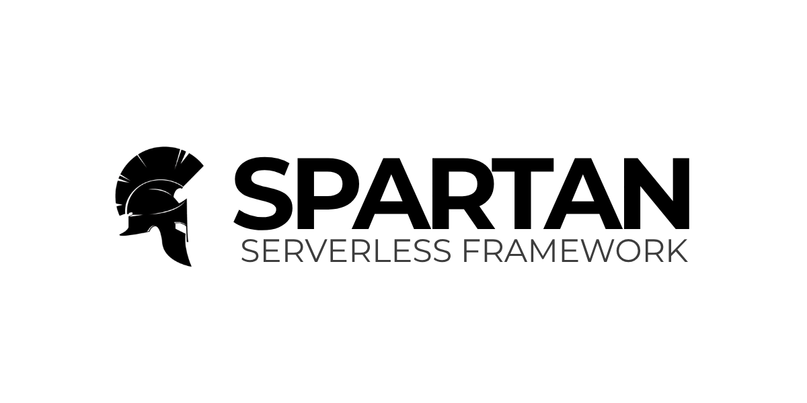

<p align="center"></p>

# Spartan Serverless Framework

## About
Spartan Serverless Framework—"the Swiss Army knife for serverless development"—is a powerful scaffold that simplifies the creation of serverless applications on AWS. It streamlines your development process and ensures code consistency, allowing you to build scalable and efficient applications on AWS with ease.

#### Spartan Serverless Framework is versatile and can be used to efficiently develop:
- RESTful API
- Workflows or State Machines
- Small or Medium-sized ETL Pipelines
- Containerized Microservices
- Agentic AI (Coming Soon)

Fully tested in AWS, Spartan Serverless Framework is also compatible with other cloud providers like Azure and GCP, making it a flexible choice for a wide range of serverless applications.


## Installation
1. To install the spartan command line tool
```bash
pip install python-spartan
```

2. Try
```bash
spartan --help
```

## Usage
1. Install all the required packages
```bash
python -m venv .venv
pip install -r requirements-dev.txt
```
2. Copy the .env.example to .env

3. Configure the migration
```bash
spartan migrate init -d sqlite
```

4. Create all the tables
```bash
spartan migrate upgrade
```

5. Insert dummy data
```bash
spartan db seed
```

## Testing
```bash
pytest -vv
```

## Changelog

Please see [CHANGELOG](CHANGELOG.md) for more information on what has changed recently.

## Contributing

Please see [CONTRIBUTING](./docs/CONTRIBUTING.md) for details.

## Security Vulnerabilities

Please review [our security policy](../../security/policy) on how to report security vulnerabilities.

## Credits

- [Sydel Palinlin](https://github.com/nerdmonkey)
- [All Contributors](../../contributors)

## License

The MIT License (MIT). Please see [License File](LICENSE) for more information.
